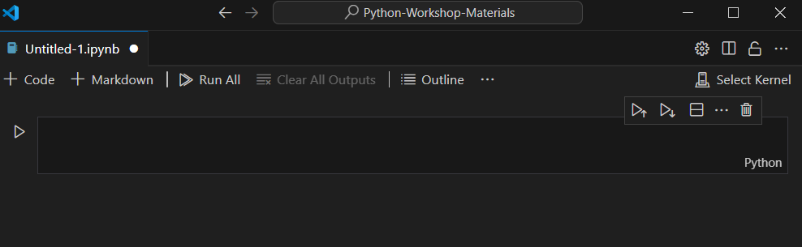
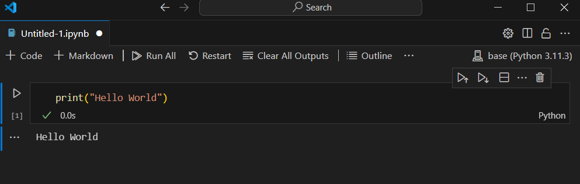

# Python Primer  
Welcome to the Chemistry Department Programming Workshop Python Primer!  
   
This tutorial is meant to prepare you for the workshop activities to come, so it is important that all software and dependencies are functioning before our first full workshop day.  
  
This Python Primer consists of 3 sub-modules:  
* [`0.0 Software Installation`](./0.0_python_primer_software_installation.md) – installing python, dependencies and text editor  
* [`0.1 Syntax Fundamentals`](./0.1_python_primer_syntax_fundamentals.ipynb) – basic loops, types, functions and python philosophy  
* [`0.2 Package Installation and Management`](./0.2_python_primer_package_installation_and_management.md) – how to handle problematic installations and read documentation
## 0.0 Software Installation
---

**Contents**  
  
In this module, you will:
 * [0.0.1 Install python](#001-installing-python)
 * [0.0.2 Install a package manager](#002-installing-a-package-manager)
 * [0.0.3 Install jupyter notebooks](#003-installing-jupyter-notebooks)
 * [0.0.4 Install a text editor](#004-installing-a-text-editor)


## 0.0.1 Installing Python

There are many different versions and distributions of Python available for download. We will be installing **[Miniconda](https://docs.anaconda.com/miniconda/)**, a popular python distribution that takes up less disk space than its cousin **[Anaconda](https://www.anaconda.com/download/success)**. Installing python from the **Anaconda** distribution will download many additional programs and packages that are not needed for our basic tutorial. 
   
While the python language is a free and open source project, both the **Anaconda** and **Miniconda** distributions are managed by a private company. This company (continuum.io) packages the source code and dependencies needed to use python into a distribution that is easily installed.
  
:memo: **Note:** If you know you have previously installed versions of python on your machine, please create a new environment to use for the workshop materials. Ask a workshop organizer for help to ensure your local environment is stable before proceeding.

Otherwise, to install **Miniconda**:  
  
1. navigate to https://docs.anaconda.com/miniconda/miniconda-install/ 
1. download the appropriate installer for your system and navigate the prompts to install
  
Test that the installation worked properly by opening your anaconda prompt and entering the following text:  
```
python --version
```
This should return the python version number. If it does not, please ask a workshop leader for help. You may need to manually add python to your system path following instructions similar to those at [this link](https://realpython.com/add-python-to-path/).

## 0.0.2 Installing a Package Manager

Package managers are used to install code developed by other entities into your local environment. This code, called a `package` or `library` may depend on other libraries/packages that needs to be installed together. The package manager is able to find the package you want to install, identify the packages that code needs in order to run (dependencies), and install all of this code into an environment that you can use.  
More details on package management will be covered in [**0.2 Package Installation and Management**](0.2_python_primer_package_installation_and_management.md).
  
The miniconda distribution comes with a default package manager called `conda`. Noat all packages you may want are registered with the conda package manager, so it is useful to install the other common package manager `pip`.  
  
To install `pip`, first load the anaconda prompt.
In the anaconda prompt, enter the following command:
```
conda install pip
```

This tells the default package manager `conda` to search the internet for the source code of the package manger `pip`. When conda finds the code, it will download the files into this directory:   
  
`C:users\\anaconda-base-directory\envs\your-env-name\Lib\site-packages\`  
  
By default, the packages you install into your `(base)` environment will end up here instead:  
  
`C:users\\anaconda-base-directory\Lib\site-packages\`  
  
It is best not to manually edit or move these files unless you knoe what you are doing.  

To check if `pip` was installed correctly, enter the following command into the anaconda prompt:  
```
conda list
```
This will list all packages currently installed in your current environment. You can scroll through the list to locate pip. The other packages you see in the list are installed by default through the **Miniconda** distribution.  
  
You can also locate these files directly through your file management system by navigating to the directories listed above.    


## 0.0.3 Installing Jupyter Notebooks

Python programs come in two varieties, python `scripts` and python `notebooks`.  
Script files end in `*.py` and notebook files end in `*.ipynb`.  

**Here are the main differences:**  
  
**`Script`** files execute one line at a time from the top of the file to the bottom. When you hit run, all of the code in the entire file will run. Plots and other outputs are opened in a new window or printed one after the other directly to the console. Script files are typically used to encapsulate final bodies of code used for production.  
    
**`Notebook`** files consist of multiple `cells`. Each `cell` can be executed independently, and may be run out of order (i.e. not from top to bottom. Cells may contain either text or code. Plots and other results are printed directly below the running cells. Notebook files are typically used for prototyping code that will eventually be written into script files, or for interactive tutorials, data analytics and to demonstrate operations.  
  
This workshop will focus primarily on `notebook` files.  
  
To use a `notebook` file, we need to install the python package `notebook` from the [Jupyter Project](https://jupyter.org/install) "Jupyter Notebooks".  

To do this, open your anaconda prompt and enter the following:  
```
pip install notebook
```
  
This launches the pip package manager we installed previously. The package manager will search the internet for the code we need from the Jupyter Project and install it in the correct directory on our local machine. When prompted, select 'yes' to complete the install.     
  

## 0.0.4 Installing a Text Editor  

A text editor is the software program where you will write the code used throughout the workshop. Popular text editors include Notepad++, Eclipse, PyCharm and Spyder. Most of the common text editors include helpful tools to assist in debugging code, highlighting errors and autocompleting statements. Some text editors (like Spyder and Eclipse) do not support `notebook` files, and others support a wide array of filetypes. Jupyter Notebooks includes a default text editor that will allow you to edit and run `notebook` files through HTML in your browser.  
  
The choice of text editor is largely based on personal preference. We will be installing **VSCode** (which is developed by Microsoft) because it supports a wide array of file types (including python `scripts` and python `notebooks`), and is one of the most preferred text editors across multiple programming languages.  

### To install VSCode:  
Follow the instructions [here](https://code.visualstudio.com/download) to download the appropriate version for your operating system. When the installation is finished and you open VSCode for the first time you will be asked to configure several preferences. Follow the prompts to complete the installation.  

### To add the python extension:  
VSCode has many extensions that extend its capabilities. Extensions usually allow different filetypes, support dynamic code checking or syntax highlighting. We will install 2 extensions for Python and Jupyter Notebooks.  
  
Navigate to the 'Extensions' tab (5th symbol down from the left bar, looks like a bunch of cubes) and search for the Python extension. After installing the python extension, search for 'Jupyter' and install the extension. Close your VSCode and restart the program when you have installled both extensions. (For more help with python in VSCode, see [here](https://code.visualstudio.com/docs/languages/python#:~:text=The%20Python%20and%20Jupyter%20extensions,as%20run%20and%20debug%20them.&text=You%20can%20also%20connect%20to,server%20to%20run%20your%20notebooks.)).

### To test that python works:  
When you have restarted your VSCode, create a new *.ipynb file. When the file opens, there should be an option in the upper right to 'Select kernel' or 'Detect kernel'.
  
  

The kernel is the source of your python installation. If you click on 'Select kernel' there should be a pop-up menu. Select 'Python Environments' and follow the prompts to link with the python version you downloaded.  
  
If this is not intuitive, you may not have added python to your system-wide path. Ask an instructor for help or follow [this link](https://realpython.com/add-python-to-path/). Alternatively, [this tutorial](https://code.visualstudio.com/docs/python/python-tutorial) may be helpful.  
  
When you have selected the appropriate python kernel, try typing the code below into the cell. Hit the triangle 'play' button on the left to run the cell.  
  
  
   
If you don't have any errors, you know you have correctly integrated your python distribution with VSCode!  
If you do have error messages, ask an instructor for help and/or google the error message for help.  

---
### Congratulations!  
You have now completed the first of 3 modules in the Python Primer.  
Please proceed to [**0.1 Syntax Fundamentals**](./0.1_python_primer_syntax_fundamentals.ipynb).
