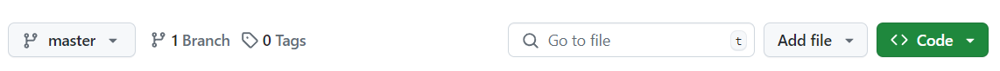

# Python Primer  
Welcome to the Chemistry Department Programming Workshop Python Primer!  
   
This tutorial is meant to prepare you for the workshop activities to come, so it is important that all software and dependencies are functioning before our first full workshop day.  
  
This Python Primer consists of 3 sub-modules:  
* [`0.0 Software Installation`](./0.0_python_primer_software_installation.md) – installing python, dependencies and text editor  
* [`0.1 Syntax Fundamentals`](./0.1_python_primer_syntax_fundamentals.ipynb) – basic loops, types, functions and python philosophy  
* [`0.2 Package Installation and Management`](./0.2_python_primer_package_installation_and_management.md) – how to handle problematic installations and read documentation
## 0.2 Package Installation and Management
---

**Contents**  
  
In this module, you will cover:
 * [0.2.1 Managing Python Environments](#021-managing-python-environments)
 * [0.2.2 Installing a Package](#022-installing-a-package)
 * [0.2.3 Finding and Reading the Docs](#023-finding-and-reading-the-docs)
 * [0.2.4 Checking Package Dependencies](#024-checking-package-dependencies)


## 0.2.1 Managing Python Environments

### Whats a Python Environment?  
Python environments (conda environments) are directories where specific python packages are installed. When you run a python script, it requires a python environment to execute. The python environment contains information on which version of python to use and what packages are available.  
  
By default, the **Miniconda** terminal will open in the `(base)` python environment. When you install a package, your package manager searches the internet for the code and dependencies and copies them to the active environment folder. You can find the `\envs\` folder by opening the directory where you installed **Miniconda**. Packages you install using your package manager will be copied to `\envs\your-env-name\Lib\site-packages\`.


If you have not created any new python environments, this folder will be empty. Your `(base)` environment packages are installed at `\Lib\site-packages\` within the directory where you installed **Miniconda**.  

### When should you use Python Environments?
Python best practices suggest that you should **never** install packages into your `(base)` environment. Packages installed in your `(base)` environment can potentially impact packages in other environments if not managed properly. Instead, you should consider making a new python environment for different projects. This is more important for developers who work in python and need to manage different codespaces, but this may become relevant for you as well.

Python environments are most useful when you need multiple versions of a package or its dependencies. Because each environment contains the packages, dependencies, and python version information separate from other environments, python environments can effectively operate independently of one another.  
  
Here's an example of possible python environment structure:  
* `(base)`  
  - contains standard packages needed for data analysis and plotting  
  - use this environment when performing standard tasks
  
* `(GoodVibes)`  
  - contains code and dependencies for an analysis package you found on Github from a paper
  - you made a new environment to manage this code so that the package versions it requires are installed correctly and don't mess up your `(base)` environment 
   
* `(machinelearning)`  
  - contains more different packages you are exploring from a youtube tutorial  
  - you might be interested in adding these to your `(base)` environment, but wanted to test them out before possibly breaking your `(base)` environment  

## 0.2.2 Installing a Package 
Most commonly used packages are pretty easy to install, and can be found through the package managers **pip** or **conda**. Now that you have an introduction to python environments, let's practice installing a package in a new python environment.
  
For this example, you will first create a new python environment. Open the anaconda prompt. You can start by checking which python environments you currently have accessible with the following command:  
```
conda env list
```  
This should yield a result that looks like this:  
```
# conda environments
# 
base                  *  C:\path\to\your\miniconda-install
```  
The asterisk indicates that the base environment is currently active, and the path will show where the root directory of the environment is located.  
  
To create a new environment, use the following command:  
```
conda create env --name mytestenv
```  
Proceed when prompted by the terminal.  
This will create a new environment called `mytestenv`. Environment names should be short (usually 3-10 characters) and not have spaces. Check that this worked with the `conda env list` command:  
```
# conda environments
# 
base                  *  C:\path\to\your\miniconda-install
mytestenv                C:\path\to\your\miniconda-install\envs\mytestenv
```
You can also navigate to the folder using your file manager to see where the environment was created.  
  
The asterisk still indicates that the base environment is active. You can change to the new environment with this command:  
```
conda activate mytestenv
```
  
Now you are in your new python environment. Some packages may have been installed by default. You can check which packages are installed with this command:
```
conda list
```
  
Now you need a package to install -  
  
Let's check out the source code for **matplotlib** located at https://github.com/matplotlib/matplotlib.  
Open the link and click through some folders to explore the codebase. Because **matplotlib** is a larger package, its developers have made it discoverable by common package managers, including **pip** and **conda**.  
  
Install **matplotlib** using a package manager and one of the following commands:  
```
pip install matplotlib
# or
conda install matplotlib
```  
Once the package is installed, check your environment folder to see what has changed. The new package should be installed here: `C:\path\to\your\miniconda-install\envs\mytestenv\Lib\site-packages`. There should be a folder with the package name. There will likely be many more new folders that were added for all of the dependencies!  
  
Most packages will have installation instructions that look similar to the instructions above. However, some smaller packages written by other scientists for a paper or for internal use will not be available using a package manager. For these packages, you will need to install using the source code from Github. You should always check that the code is not installable via a package manager before trying to install from Github.

### Installing from Github
Github is an online code repository (similar to Google Drive) primarily used by programmers to maintain code. Many developers publish their code to Github to be used by others in the community, and the source code for many packages you might install using a package manager is actually stored online on Github.  
  
Some packages are only available on Github though, and package managers won't be able to find and install them into your local python environment. In these cases, its important to know how to install packages manually. 

To start, you'll want to make sure that you have **pip** and **git** installed in your python environment. If you are unsure, you can check using **conda list**, and then install the package using **conda** or **pip**.  
  
Once you have **pip** and **git** installed, you will need to navigate to the project's source code on Github. Click the big green **Code** button and copy the https link.  
  
Now to install, you will use both **pip** and **git**:  
```
pip install git+<copy-your-https-link-here>
```  
  
This is usually a last resort, and may fail if you try to install a package that is already distributed via **conda** or **pip**. If you can't install the code this way, you may have to resort to copy/pasting from the source code.  
  
  
---
For more help on conda environments, see this [link](https://conda.io/projects/conda/en/latest/user-guide/tasks/manage-environments.html).  You can switch environments using the conda activate syntax, and delete environments by deleting the folder in the file manager or with:  
```
conda deactivate
conda env remove --name environment_name
```

## 0.2.3 Finding and Reading the Docs
Most commonly used packages like **matplotlib**, **pandas**, or **numpy** have great documentation online. Usually, the best way to find the documentation for the specific function or method you are using is to simply google the function to find the documentation provided by the developers. This is a good first step if your code is not working as you expect. StackExchange is also a good source, and you may even use a large language model such as ChatGPT.


Let's check out the **numpy** documentation as an example.  
  
Navigate to the **numpy** documentation page for the function `numpy.arange`. This should come up in an easy google search, or you can use [this link](https://numpy.org/doc/stable/reference/generated/numpy.arange.html). You should find youself at a page that looks like this:  
  
  
  
To deconstruct this function, we will first start with the arguments. These are separated by commas in the statement. Arguments in square brackets '[ ]' are optional, and the function will work without these values. Other arguments with an equals sign '=' show their default values. This is explained further in the *Parameters* section:  
  
  
  
This section outlines all of the input arguments and their types with a brief description.  
  
Following parameter definitions, most code will describe the output:  
  
  
  
and may even give some brief examples of its use:  
  
   
  
For most functions, you can use the help function to display this documentation in your terminal. For numpy.arange(), you would type:
```
help(numpy.arange)
```

## 0.2.4 Checking Package Dependencies 
In most cases, your package manager will handle your dependencies. Occasionally, you will get an error due to an already installed version being out of date, or your package manager not being able to find a dependency. In these cases, its useful to be able to check your package dependencies.  
  
**conda** checks your package dependencies at the time of install, and may fail the install of the package you want due to a missed dependency along the way. If this happens, you can manually install that single package in  the version you need in your environment using **conda** or **pip** and re-try the install.  
  
**pip** does not check the dependencies at the time of install. Your desired package may successfully install, but it will not work because of its failed dependencies. You can check that all of your required dependencies are solved in your current environment with `pip check`. If unsolved dependencies are identified, you can install them manually.

  
  
  
---
### Congratulations!  
You have now completed the Python Primer.
  
You should be able to 
* have python installed and working with notbeook files using VSCode
* understand basic python syntax and philosophy
* install new packages using pip, conda or github and read the docs  

We look forward to seeing you again next week at the [Python Workshop Day 1](../Workshop_Day1/)!
  